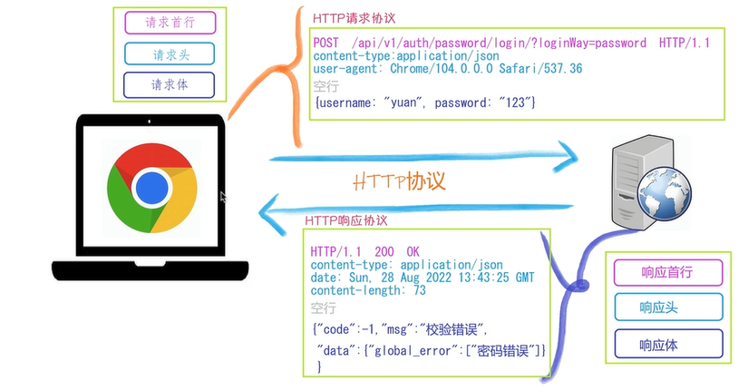

## http协议特性
### (1) 基于TCP/IP协议
http协议是基于TCP/IP协议之上的应用层协议。
### (2) 基于请求-响应模式
HTTP协议规定:请求从客户端发出,最后服务器端响应该请求并返回。换句话说,肯定是先从客户端开始建立通信的,服务器端在没有接收到请求之前不会发送响应。
### (3) 无状态保存
HTTP是一种不保存状态,即无状态(stateless)协议。HTTP协议自身不对请求和响应之间的通信状态进行保存。也就是说在HTTP这个级别,协议对于发送过的请求或响应都不做持久化处理。
使用HTTP协议,每当有新的请求发送时,就会有对应的新响应产生。协议本身并不保留之前一切的请求或响应报文的信息。这是为了更快地处理大量事务,确保协议的可伸缩性,而特意把HTTP协议设计成如此简单的。
### (4) 短连接
HTTP1.0默认使用的是短连接。浏览器和服务器每进行一次HTTP操作,就建立一次连接,任务结束就中断连接。
HTTP/1.1起,默认使用长连接。要使用长连接，客户端和服务器的HTTP首部的Connection都要设置为keep-alive,才能支持长连接。
HTTP长连接,指的是复用TCP连接。多个HTTP请求可以复用同一个TCP连接,这就节省了TCP连接建立和断开的消耗。

## http请求与相应协议

